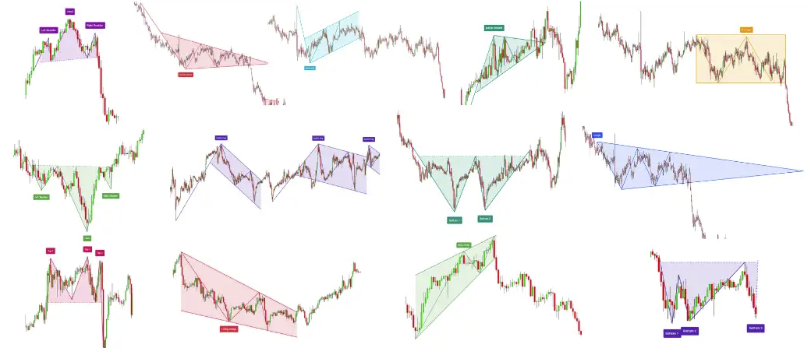

# PatternPy: The Premier Python Package for Trading Pattern Recognition 🔥


## Description
PatternPy is a powerful Python package designed to transform the way you analyze financial markets. Our mission is to make complex trading pattern recognition accessible and efficient for all. With PatternPy, you can effortlessly identify intricate patterns like the head and shoulder, multiple tops and bottoms, horizontal support and resistance, and many more from OHLCV data.

Empowered by the elegance of Pandas and the efficiency of Numpy, PatternPy delivers high-speed performance without compromising on accuracy or user-friendliness. Whether you are a seasoned trader or a beginner, PatternPy is your go-to tool for bringing precision and speed to your market analysis.

## Why PatternPy?
Our package stands out for several reasons:

- Unique in the Market: There's nothing else like PatternPy. We provide an all-in-one solution for trading pattern identification, combining power, versatility, and simplicity.
- High-Speed Performance: Designed with vectorization concepts, PatternPy processes large volumes of data with impressive speed, allowing you to get the information you need, when you need it.
- Flexible and Customizable: You can easily adjust the window size to suit your preferences, offering a balance between sensitivity and false-positive control.
- Potential for Wealth Creation: PatternPy is designed to help you recognize lucrative trading opportunities with greater efficiency and accuracy, potentially leading to increased wealth.




## 📈 Trading Patterns: The Gearhead's Guide to Chart Alchemy! 🔧

- Head & Shoulders and its Mirror-Twin, Inverse Head & Shoulders: Think of this as the stock market's homage to a medieval warrior's stance. The head - the pinnacle of price prowess. The shoulders - slightly lower, but they pack a punch. When it goes inverse, that’s the stock market moonwalking! Keep an eye, because something's about to give. ⚔️
- Multiple Tops & Bottoms - The Horizontal Tango: When stock prices are doing the cha-cha on the charts, swinging back and forth without breaking out – that’s the Horizontal Tango for you! Put on your dancing shoes because reading this pattern needs finesse and perfect timing. 💃

- Horizontal Support & Resistance - The Price Bouncers: These levels are like the elite bouncers at an exclusive club. Prices need VIP access to get past them! They’ve been rejected entry before, so will they turn around or sweet-talk their way through this time? 🕶️

- Ascending & Descending Triangles - Tension Rising: These triangles are like a rubber band stretching – the suspense is nerve-wracking. Is it going to snap upwards or fizzle out downwards? This pattern is the market's own thriller genre. 🍿

- Wedges: Converging Destiny: Think of wedges as two trendlines playing a high-stakes game of chicken – speeding towards each other to see who veers off first. When they collide, prices could catapult in any direction. Buckle up! 🚀

- Channel Up & Down - The Stock Superhighway: If stocks were cars, channels would be their autobahns. Unfettered, high-octane movement within defined lanes. Just watch out for those exits - detours might lead to whole new landscapes! 🏎️

- Double Top & Bottom - The Market's Deja Vu: When prices hit a level, recoil, and then - BOOM - they're back again, it’s like the market is trying to perfect a stunt it couldn't nail the first time. A daring double-attempt before the grand finale! 🎯

- Trend Line Support & Resistance - The Market’s Elders: These lines are like the wise old sages of stock lore. They've seen things, they know things. Their wisdom? A roadmap of where prices found refuge or faced their nemesis. Respect the elders! 🧙

- Higher-High & Lower-Low - The Chart Adventurer's Quest: Grab your explorer hat because this pattern is an expedition to uncharted territories. New highs or new lows - they’re the breadcrumbs that lead to the heart of market trends. 🗺️

## Installation
You can install PatternPy by cloning this repo and placing it in your working directory, then importing it like usual:
```
$ pip install patternpy
``` 
## Usage
Once installed and imported, you use PatternPy as follows:
```
from patternpy import head_and_shoulders

# Have price data (OCHLV dataframe)
df = pd.Dataframe(stock_data)

# Apply pattern indicator screener
df = head_and_shoulders(df)

# New column `head_shoulder_pattern` is created with entries containing either: NaN, 'Head and Shoulder' or 'Inverse Head and Shoulder'
print(df)
```

See our usage guide for more detailed instructions and examples.

## Future Plans
We're always looking to improve PatternPy. Some areas we're exploring include:

- Adding more trading patterns based on user suggestions.
- Enhancing visualization and plotting features for better pattern understanding.
- Incorporating unit testing for code reliability.
- We welcome your suggestions for new features and improvements!

## Contribute
PatternPy is an open-source project, and we welcome contributions of all kinds: new features, bug fixes, documentation, and more. Please see our contribution guide for more information.


Join us on this exciting journey to revolutionize trading pattern recognition. Let's create wealth together with PatternPy!

